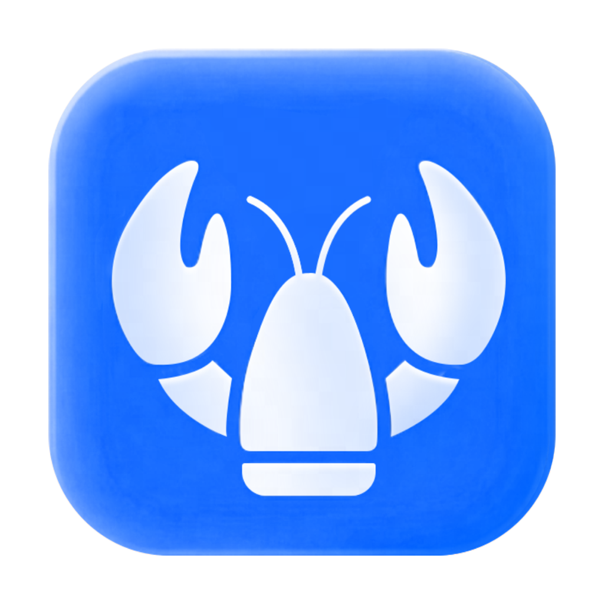
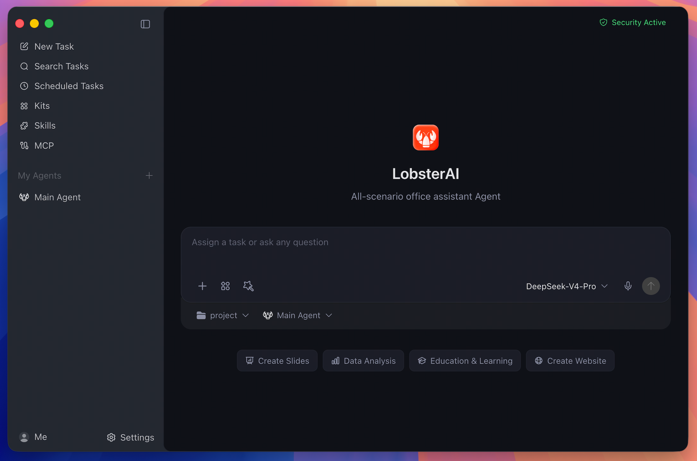
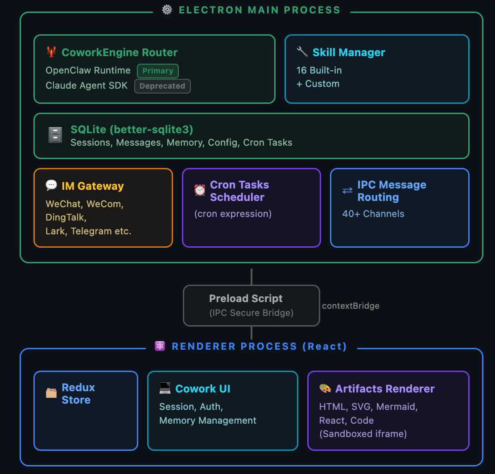

<h1 align="center">
  <br>
  EgoAI
</h1>

<p align="center">
  <a href="LICENSE"></a>
  
  
  
  
</p>

<p align="center">
  English · <a href="README_zh.md">中文</a>
</p>

<p align="center">
  <strong>A general-purpose desktop Agent that works in your real working environment.</strong><br/>
  Local-first · built on the LobsterAI desktop skeleton and the OpenClaw Agent runtime
</p>

<p align="center">
  <a href="#what-is-egoai"><strong>What Is EgoAI</strong></a>
  &nbsp;·&nbsp;
  <a href="#roadmap"><strong>Roadmap</strong></a>
  &nbsp;·&nbsp;
  <a href="#features"><strong>Features</strong></a>
  &nbsp;·&nbsp;
  <a href="#developing"><strong>Developing</strong></a>
</p>

<p align="center">
  
</p>

## What Is EgoAI

EgoAI is a general-purpose desktop Agent application. It operates in your real working environment: local files, terminal commands, browser workflows, documents, spreadsheets, slides, IM channels, scheduled jobs, and project workspaces.

- **Local-first**: sessions, app data, and Agent memory live on your machine. The data stays local by default.
- **Built from LobsterAI's skeleton**: the desktop shell, Cowork product/session layer, OpenClaw Agent runtime, MCP client, and the skills / agents / artifacts system are carried over intact, rebranded to EgoAI.
- **Integration principle**: reuse existing capability as much as possible — glue code only (process management, config registration, branding), no new business logic unless necessary.

`Cowork` is the product/session layer that owns sessions, messages, permissions, UI state, local persistence, artifacts, and IPC contracts. `OpenClaw` is the runtime and gateway underneath it. That split keeps local persistence and the UI in the desktop app while delegating agent execution to OpenClaw.

## Roadmap

The app evolves in stages per the *General-Purpose Desktop Agent Integration Plan*. Stage 0 is done; stages 1–2 add domain skills and a local knowledge base.

| Stage | Scope | Status |
| --- | --- | --- |
| **0** | Initialize & prune the skeleton: rename to EgoAI, drop NetEase-specific channels (POPO / NIM / NetEase Bee) and video/image generation skills, clean dead identifiers, ship a blue brand icon set | ✅ Done |
| **1** | Tender-writing skill + `bid-designer` preset Agent (reuse the bid project's `SKILL.md`; the two-phase workflow runs on the Agent runtime) | Planned |
| **2** | Local knowledge base + RAG: `weknora-lite` backend + MCP server (Agent retrieval line) + an embedded management UI (user line); vectorization defaults to local Ollama | Planned |
| **3** | GraphRAG + offline evaluation (optional enhancement) | Optional |

## Features

### Desktop Cowork Sessions

Run long-form Agent tasks against local projects and files. EgoAI streams progress, keeps session history, renders tool output, and asks for approval before sensitive actions such as file operations, terminal commands, or network access.

### Multi-Agent Workflows

Create custom Agents with their own identity, model choice, skills, working directory, enabled state, and IM bindings. Keep the Main Agent for general work and use specialized Agents for repeatable roles.

### Skills

Ships with 25 built-in skills configured in `SKILLs/skills.config.json`, including web search, Word documents, spreadsheets, PowerPoint, PDF processing, Remotion video rendering, browser automation, stock research, content writing, weather, and skill creation.

### MCP Servers

Connect external tools and data sources through Model Context Protocol servers. EgoAI stores user-configured servers locally and syncs enabled servers into OpenClaw.

### Scheduled Tasks

Create recurring work either by conversation or through the scheduled task UI. Use it for daily news digests, inbox summaries, website monitoring, weekly reports, and other repeatable work.

### IM Remote Control

Reach your desktop Agent from WeChat, WeCom, DingTalk, Feishu/Lark, QQ, Telegram, Discord, and email. Multi-instance platforms can bind different accounts or channels to different Agents.

### Rich Artifacts

Preview and manage generated HTML, SVG, images, video, Mermaid diagrams, code, Markdown, text, documents, and local service artifacts inside the desktop app.

### Local Memory And Data

Sessions and app data live locally in SQLite (`egoai.sqlite` under Electron `userData`). OpenClaw workspace memory uses files such as `MEMORY.md`, `USER.md`, `SOUL.md`, and daily notes, so durable preferences and project context can carry across sessions.

## Real-World Prompts

| Scenario | Example prompt |
| --- | --- |
| Build a local system | "I still track inventory and sales in Excel. Build a local inventory system that records purchases and sales, calculates stock and profit, and opens in my browser." |
| Analyze local data | "Use `product-growth.xlsx` to build a visual dashboard and summarize the main growth drivers." |
| Generate a deck | "Research the AI Agent market and turn the findings into a presentation." |
| Automate browser checks | "Open the ads dashboard every morning, check spend and conversion anomalies, and summarize likely causes." |
| Screen documents | "Turn the resumes in this folder into a screening sheet and shortlist the strongest candidates against the JD." |
| Run scheduled work | "Every weekday at 9 AM, collect yesterday's AI news and send me a concise digest." |

## How It Works

<p align="center">
  
</p>

- **Renderer**: React, Redux Toolkit, Tailwind, artifact renderers, settings, agent/session UI, skills, MCP, scheduled tasks, and IM configuration.
- **Main process**: Electron lifecycle, IPC, SQLite persistence, auth, logging, OpenClaw startup, runtime repair, skill sync, IM gateways, and artifact services.
- **OpenClaw integration**: `openclawEngineManager`, `openclawConfigSync`, `openclawRuntimeAdapter`, and `coworkEngineRouter` translate EgoAI state into OpenClaw runtime behavior.

## Install

### Run From Source

Requirements:

- Node.js `>=24.15.0 <25`
- npm

```bash
git clone git@github.com:LeXiaoWen/EgoAI.git
cd EgoAI
npm install
```

First development run:

```bash
npm run electron:dev:openclaw
```

Daily development after the pinned OpenClaw runtime exists:

```bash
npm run electron:dev
```

The renderer dev server runs at `http://localhost:5175`.

## Developing

```bash
# Production renderer bundle
npm run build

# Electron main/preload TypeScript build
npm run compile:electron

# Official Vitest entry used by CI
npm test

# Full ESLint across src; may expose existing legacy debt
npm run lint

# CI-style lint for touched TypeScript files
npx eslint --ext ts,tsx --report-unused-disable-directives --max-warnings 0 <files>
```

### OpenClaw Runtime

The pinned OpenClaw version and third-party plugin list live in `package.json` under `openclaw`.

```bash
# Build the current-platform runtime manually
npm run openclaw:runtime:host

# Use a custom OpenClaw source checkout
OPENCLAW_SRC=/path/to/openclaw npm run electron:dev:openclaw

# Force runtime rebuild
OPENCLAW_FORCE_BUILD=1 npm run electron:dev:openclaw

# Keep a local OpenClaw checkout on its current branch/tag
OPENCLAW_SKIP_ENSURE=1 npm run electron:dev:openclaw
```

### DeepSeek Harness Runtime

The pinned dsh version and one archive descriptor per platform live in `package.json` under `dsh`. Development reads `vendor/dsh-runtime/current`; shipped apps download the archive on first use and verify it against the digest they carry.

```bash
# Build and activate the current-platform runtime
npm run dsh:runtime:host

# Boot it once and assert the web UI answers
npm run dsh:runtime:verify

# Full gate: build, pack, install over HTTP, boot, delegate a coding task
npm run dsh:e2e
```

## Packaging

<details>
<summary>Build desktop installers</summary>

```bash
# macOS
npm run dist:mac
npm run dist:mac:x64
npm run dist:mac:arm64
npm run dist:mac:universal

# Windows
npm run dist:win

# Linux
npm run dist:linux
```

Packaging bundles the OpenClaw runtime under `Resources/cfmind`. Windows builds also bundle a portable Python runtime under `resources/python-win`, so end users do not need to install Python manually.

</details>

## Project Map

| Path | Purpose |
| --- | --- |
| `src/main/main.ts` | Electron lifecycle, IPC registration, auth, logging, runtime startup, and service wiring |
| `src/main/libs/openclawEngineManager.ts` | OpenClaw gateway process, runtime state, ports, logs, restart, and repair |
| `src/main/libs/openclawConfigSync.ts` | Renders EgoAI providers, models, agents, IM bindings, skills, MCP, and workspace instructions into OpenClaw config |
| `src/main/libs/agentEngine/openclawRuntimeAdapter.ts` | Translates OpenClaw gateway events into Cowork stream events |
| `src/main/coworkStore.ts` | Cowork sessions, messages, config, agents, memory metadata, and SQLite CRUD |
| `src/renderer/components/cowork/` | Main Cowork UI, prompt input, session detail, permissions, thinking/tool display, media, and voice input |
| `src/renderer/components/agent/` | Agent creation and settings UI |
| `src/renderer/components/skills/` | Skill management UI |
| `src/renderer/components/mcp/` | MCP server management UI |
| `src/renderer/components/scheduledTasks/` | Scheduled task list, form, detail, run history, and templates |
| `src/renderer/services/i18n.ts` | Renderer i18n dictionary and `t()` helper |
| `SKILLs/` | Bundled EgoAI skills |

## Security And Data

- Renderer windows use context isolation, disabled Node integration, and sandboxing.
- Renderer-to-main access goes through preload IPC APIs.
- Sensitive tool actions are permission-gated and logged.
- App data is stored locally in `egoai.sqlite` under Electron `userData` (`EgoAI`).
- OpenClaw state, workspace memory, generated config, and gateway logs live under `userData/openclaw`.

## License

[MIT License](LICENSE)
