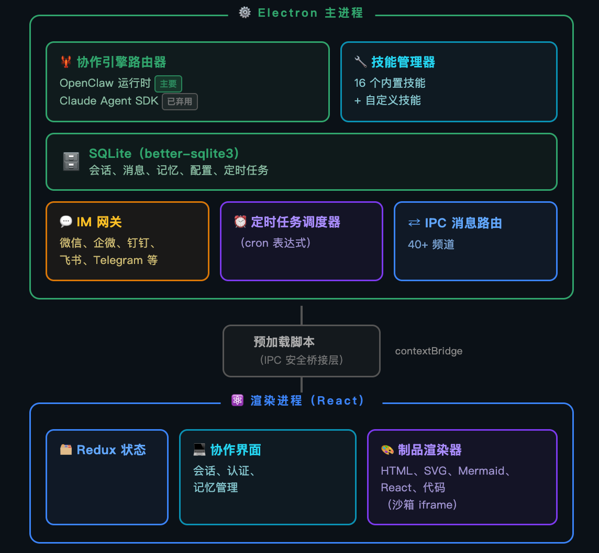

<h1 align="center">
  <br>
  EgoAI
</h1>

<p align="center">
  <a href="LICENSE"></a>
  
  
  
  
</p>

<p align="center">
  <a href="README.md">English</a> · 中文
</p>

<p align="center">
  <strong>通用桌面 Agent 应用 —— 在你的真实工作环境里工作的本地 Agent。</strong><br/>
  本地优先 · 基于 LobsterAI 桌面骨架与 OpenClaw Agent 运行时
</p>

<p align="center">
  <a href="#egoai-是什么"><strong>EgoAI 是什么</strong></a>
  &nbsp;·&nbsp;
  <a href="#路线图"><strong>路线图</strong></a>
  &nbsp;·&nbsp;
  <a href="#功能特性"><strong>功能特性</strong></a>
  &nbsp;·&nbsp;
  <a href="#开发"><strong>开发</strong></a>
</p>

<p align="center">
  
</p>

## EgoAI 是什么

EgoAI 是一个通用桌面 Agent 应用，能够在你的真实工作环境中操作：本地文件、终端命令、浏览器流程、文档、表格、演示、IM 渠道、定时任务与项目工作区。

- **本地优先**：会话、应用数据与 Agent 记忆都保存在本机，数据默认不出机。
- **基于 LobsterAI 骨架**：桌面壳、Cowork 产品/会话层、OpenClaw Agent 运行时、MCP 客户端以及技能 / Agent / Artifacts 体系原样继承，改名重构为 EgoAI。
- **整合原则**：尽可能复用现有能力，只做「装配/胶水」代码（进程拉起、配置注册、品牌改名），除非必要不新增业务逻辑。

`Cowork` 是产品/会话层，负责会话、消息、权限、UI 状态、本地持久化、Artifacts 与 IPC 契约；`OpenClaw` 是其下的 Agent 运行时与网关。这一划分让本地持久化与界面留在桌面应用里，而把 Agent 执行委托给 OpenClaw。

## 路线图

应用按《通用桌面 Agent 整合规划》分阶段演进。阶段 0 已完成；阶段 1–2 将补充领域技能与本地知识库。

| 阶段 | 范围 | 状态 |
| --- | --- | --- |
| **0** | 项目初始化与裁剪：改名 EgoAI、去掉网易特有渠道（POPO / 云信 / 小蜜蜂）与视频/图片生成技能、清理死标识、换蓝色品牌图标 | ✅ 已完成 |
| **1** | 标书写作技能 + `bid-designer` 预设 Agent（复用 bid 项目的 `SKILL.md`，两阶段工作流由 Agent 运行时执行） | 规划中 |
| **2** | 本地知识库 + RAG：`weknora-lite` 后端 + MCP server（Agent 检索线）+ 内嵌管理界面（用户管理线）；向量化默认走本地 Ollama | 规划中 |
| **3** | GraphRAG + 离线评测（可选增强） | 可选 |

## 功能特性

### 桌面 Cowork 会话

针对本地项目与文件运行长任务式 Agent 任务。EgoAI 流式展示进度、保留会话历史、渲染工具输出，并在敏感操作（文件操作、终端命令、网络访问）前请求授权。

### 多 Agent 工作流

创建拥有独立身份、模型选择、技能、工作目录、启用状态与 IM 绑定的自定义 Agent。保留主 Agent 处理日常通用工作，用专用 Agent 承担可复用的固定角色。

### 技能（Skills）

内置 25 个技能，配置在 `SKILLs/skills.config.json`，包括网络搜索、Word 文档、电子表格、PPT、PDF 处理、Remotion 视频渲染、浏览器自动化、股票研究、内容写作、天气与技能创建等。

### MCP 服务器

通过 Model Context Protocol 服务器连接外部工具与数据源。EgoAI 在本地保存用户配置的服务器，并把启用项同步进 OpenClaw。

### 定时任务

通过会话或定时任务界面创建周期性工作，适用于每日新闻摘要、收件箱汇总、站点监控、周报等重复性任务。

### IM 远程控制

通过微信、企业微信、钉钉、飞书、QQ、Telegram、Discord 与邮件触达你的桌面 Agent。多实例平台可将不同账号或渠道绑定到不同 Agent。

### 丰富的 Artifacts

在桌面应用内预览与管理生成的 HTML、SVG、图片、视频、Mermaid 图、代码、Markdown、文本、文档与本地服务 Artifacts。

### 本地记忆与数据

会话与应用数据保存在本地 SQLite（Electron `userData` 下的 `egoai.sqlite`）。OpenClaw 工作区记忆使用 `MEMORY.md`、`USER.md`、`SOUL.md` 与每日笔记等文件，让持久偏好与项目上下文跨会话延续。

## 实际场景示例

| 场景 | 示例提示词 |
| --- | --- |
| 搭建本地系统 | 「我还在用 Excel 记库存和销售。帮我搭一个本地库存系统，记录进货与销售、计算库存与利润，并在浏览器里打开。」 |
| 分析本地数据 | 「用 `product-growth.xlsx` 做一个可视化看板，并总结主要增长驱动因素。」 |
| 生成演示 | 「调研 AI Agent 市场，把结论做成一份演示。」 |
| 自动化浏览器巡检 | 「每天早上打开广告后台，检查花费与转化异常，汇总可能的原因。」 |
| 筛选简历 | 「把这个文件夹里的简历整理成筛选表，对照 JD 挑出最合适的候选人。」 |
| 定时任务 | 「每个工作日早 9 点，收集昨天 AI 新闻，给我一份简明摘要。」 |

## 工作原理

<p align="center">
  
</p>

- **渲染进程**：React、Redux Toolkit、Tailwind、Artifact 渲染器、设置、Agent/会话 UI、技能、MCP、定时任务与 IM 配置。
- **主进程**：Electron 生命周期、IPC、SQLite 持久化、认证、日志、OpenClaw 启动、运行时修复、技能同步、IM 网关与 Artifact 服务。
- **OpenClaw 集成**：`openclawEngineManager`、`openclawConfigSync`、`openclawRuntimeAdapter` 与 `coworkEngineRouter` 将 EgoAI 状态翻译为 OpenClaw 运行时行为。

## 安装

### 从源码运行

要求：

- Node.js `>=24.15.0 <25`
- npm

```bash
git clone git@github.com:LeXiaoWen/EgoAI.git
cd EgoAI
npm install
```

首次开发运行：

```bash
npm run electron:dev:openclaw
```

在固定 OpenClaw 运行时已就绪后的日常开发：

```bash
npm run electron:dev
```

渲染进程开发服务器运行在 `http://localhost:5175`。

## 开发

```bash
# 生产渲染包
npm run build

# Electron 主进程/preload TypeScript 构建
npm run compile:electron

# CI 使用的官方 Vitest 入口
npm test

# 全量 ESLint（可能暴露既有历史债务）
npm run lint

# 对改动文件的 CI 级 lint
npx eslint --ext ts,tsx --report-unused-disable-directives --max-warnings 0 <files>
```

### OpenClaw 运行时

固定的 OpenClaw 版本与三方插件清单位于 `package.json` 的 `openclaw` 字段。

```bash
# 手动构建当前平台运行时
npm run openclaw:runtime:host

# 使用自定义 OpenClaw 源码检出
OPENCLAW_SRC=/path/to/openclaw npm run electron:dev:openclaw

# 强制重建运行时
OPENCLAW_FORCE_BUILD=1 npm run electron:dev:openclaw

# 让本地 OpenClaw 检出停留在当前分支/tag
OPENCLAW_SKIP_ENSURE=1 npm run electron:dev:openclaw
```

### DeepSeek Harness 运行时

固定的 dsh 版本与每个平台的归档描述符位于 `package.json` 的 `dsh` 字段。开发时读取 `vendor/dsh-runtime/current`；发布版应用首次使用时下载归档并按自带摘要校验。

```bash
# 构建并启用当前平台运行时
npm run dsh:runtime:host

# 启动一次并断言 Web UI 有响应
npm run dsh:runtime:verify

# 完整门禁：构建、打包、HTTP 安装、启动、委派编码任务
npm run dsh:e2e
```

## 打包

<details>
<summary>构建桌面安装包</summary>

```bash
# macOS
npm run dist:mac
npm run dist:mac:x64
npm run dist:mac:arm64
npm run dist:mac:universal

# Windows
npm run dist:win

# Linux
npm run dist:linux
```

打包会把 OpenClaw 运行时打进 `Resources/cfmind`。Windows 构建还会附带便携版 Python 运行时（`resources/python-win`），终端用户无需手动安装 Python。

</details>

## 项目地图

| 路径 | 用途 |
| --- | --- |
| `src/main/main.ts` | Electron 生命周期、IPC 注册、认证、日志、运行时启动与服务装配 |
| `src/main/libs/openclawEngineManager.ts` | OpenClaw 网关进程、运行时状态、端口、日志、重启与修复 |
| `src/main/libs/openclawConfigSync.ts` | 把 EgoAI 的 providers、模型、Agent、IM 绑定、技能、MCP 与工作区指令渲染进 OpenClaw 配置 |
| `src/main/libs/agentEngine/openclawRuntimeAdapter.ts` | 把 OpenClaw 网关事件翻译为 Cowork 流事件 |
| `src/main/coworkStore.ts` | Cowork 会话、消息、配置、Agent、记忆元数据与 SQLite CRUD |
| `src/renderer/components/cowork/` | 主要 Cowork UI、提示输入、会话详情、权限、思考/工具展示、媒体与语音输入 |
| `src/renderer/components/agent/` | Agent 创建与设置 UI |
| `src/renderer/components/skills/` | 技能管理 UI |
| `src/renderer/components/mcp/` | MCP 服务器管理 UI |
| `src/renderer/components/scheduledTasks/` | 定时任务列表、表单、详情、运行历史与模板 |
| `src/renderer/services/i18n.ts` | 渲染进程 i18n 字典与 `t()` 助手 |
| `SKILLs/` | 内置 EgoAI 技能 |

## 安全与数据

- 渲染窗口启用 context isolation、禁用 Node 集成并使用沙箱。
- 渲染进程到主进程的访问走 preload IPC 接口。
- 敏感工具操作按权限门控并记录日志。
- 应用数据保存在 Electron `userData`（`EgoAI`）下的本地 `egoai.sqlite`。
- OpenClaw 状态、工作区记忆、生成的配置与网关日志位于 `userData/openclaw`。

## 许可

[MIT License](LICENSE)
